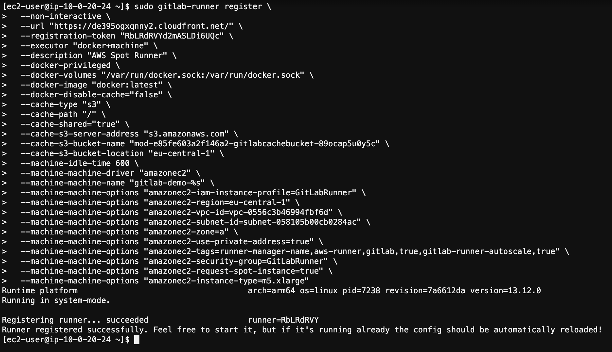

# Настройка раннеров GitLab с помощью Docker Machine (опционально)

Данный способ являлся основным подходом к настройке спотовых инстансов AWS в GitLab до недавнего времени. В настоящий момент рекомендуется использовать решение **GitLab HA Scaling Runner Vending Machine for AWS** из основных секций воркшопа. Полный список его преимуществ вы можете найти по ссылке https://gitlab.com/guided-explorations/aws/gitlab-runner-autoscaling-aws-asg/-/blob/main/FEATURES.md.

Если вы хотите использовать предыдущий способ, ниже приведены инструкции по настройке в рамках воркшопа.

Вначале мы создадим роль, которая будет использоваться раннерами.

1. Откройте консоль AWS.
2. В строке поиска консоли найдите сервис **IAM** и перейдите в него:


3. Перейдите на страницу **Policies** слева и нажмите **Create policy**.
4. Выберите вкладку **JSON** и введите следующую политику:

```json
{
    "Version": "2012-10-17",
    "Statement": [
        {
            "Effect": "Allow",
            "Action": [
                "eks:DescribeNodegroup",
                "eks:ListNodegroups",
                "eks:DescribeCluster",
                "eks:ListClusters",
                "eks:AccessKubernetesApi",
                "ssm:GetParameter",
                "eks:ListUpdates",
                "eks:ListFargateProfiles"
            ],
            "Resource": "*"
        }
    ]
}
```

5. Нажмите **Next: Tags**.
6. Нажмите **Next: Review**.
7. Введите название политики `EKS-ReadAll` и нажмите **Create policy**:


8. Повторите аналогичные действия, чтобы создать ещё одну политику. Перейдите на страницу **Policies** слева и нажмите **Create policy**.
9. Выберите вкладку **JSON** и введите следующую политику:

```json
{
    "Version": "2012-10-17",
    "Statement": [
        {
            "Action": [
                "iam:PassRole"
            ],
            "Effect": "Allow",
            "Resource": "arn:aws:iam::*:role/GitLabRunner*"
        }
    ]
}
```

10. Нажмите **Next: Tags**.
11. Нажмите **Next: Review**.
12. Введите название политики `IAM-PassRole` и нажмите **Create policy**.
13. Перейдите на страницу **Roles** слева и нажмите **Create role**.
14. В разделе **Choose a use case** выберите **EC2** и нажмите **Next: Permissions**:


15.  В форме поиска поочередно найдите политики под названиями `IAM-PassRole`, `EKS-ReadAll`, `AmazonEC2FullAccess`, `AmazonS3FullAccess` и `AmazonEC2ContainerRegistryFullAccess` и выберите все из них (важно: в рамках воркшопа мы выдаём достаточно широкие привилегии, чтобы избежать тонкой настройки политик, в промышленной среде рекомендуется более строго ограничивать привилегии). Затем нажмите **Next: Tags**.
16. Нажмите **Next: Review**.
17. На финальном экране введите в поле **Role name** название роли `GitLabRunner` и нажмите **Create role**:


Теперь мы настроим раннер, который с помощью Docker Machine будет создавать спотовые инстансы: на них будут запускаться сами задачи CI/CD. Мы можем использовать стандартную архитектуру x86, но чтобы дополнительно сэкономить, запустим инстанс на процессоре AWS Graviton2 с архитектурой ARM (подробнее можно почитать по [ссылке](https://aws.amazon.com/ru/ec2/graviton/)). При этом инстансы для выполнения задач смогут оставаться на архитектуре x86.

1. В строке поиска консоли найдите сервис **EC2** и перейдите в него:


2. В левом меню перейдите на страницу **Instances** в разделе **Instances**.
3. Нажмите **Launch instances**
4. Найдите в списке **Amazon Linux 2 AMI (HVM), SSD Volume Type**, в списке справа выберите **64-bit (Arm)** и нажмите **Select**:


5. Выберите тип инстанса **t4g.nano** (для управления созданием раннеров нам не понадобится много ресурсов) и нажмите **Next: Configure Instance Details**.
6. В выпадающем списке **Network** выберите VPC, в котором создан инстанс GitLab (значение можно найти на вкладке **Outputs** стека CloudFormation из [первой секции](Section1.md)) и нажмите **Next: Add Storage**.
7. Нажмите **Next: Add Tags**.
8. Нажмите **Add Tag**, в поле **Key** введите `Name`, а в поле **Value** – `GitLabRunnerManager`. Затем нажмите **Next: Configure Security Group**
9. В поле **Security group name** введите `GitLabRunnerManager`, остальные значения оставьте по умолчанию (то есть, доступ по SSH с любого IP-адреса) и нажмите **Review and Launch**.
10. Проверьте, что информация на последнем экране соответствует данным, приведённым в шагах выше и нажмите **Launch**:


11. В выпадающем списке **Select a key pair** выберите ключ `ee-default-keypair`, выберите галочку **I acknowledge that I have access to the selected private key file ...**, а затем нажмите **Launch Instances**.
12. Нажмите **View Instances** и дождитесь, пока статус нового инстанса станет **Running**.

После создания нам необходимо авторизовать инстанс для работы с AWS API, чтобы он мог с помощью Docker Machine создавать новые спотовые инстансы. Для этого мы назначим на него роль IAM, созданную ранее.

1. На странице **Instances** выделите инстанс **GitLabRunnerManager** и нажмите **Actions** > **Security** > **Modify IAM role**
2. В выпадающем списке **IAM role** выберите роль `GitLabRunner`. В промышленной эксплуатации лучше разделить роли для инстанса, который будет создавать новые раннеры, и для самих раннеров, чтобы следовать принципу минимальных привилегий. В таком случае, у роли, которую вы назначите на этот инстанс должны быть только привилегии для создания новых инстансов EC2 и передачи роли IAM (а также доступ к S3 на чтение/запись файлов, если вы будете хранить на нём кэш).
3. Нажмите **Save**.

После создания инстанса нам необходимо установить в нём необходимые инструменты: GitLab Runner, Docker и Docker Machine.

1. Подключитесь к инстансу по SSH: это можно сделать прямо в браузере, выбрав инстанс и нажав **Connect**, затем ещё раз **Connect** на вкладке **EC2 Instance Connect**, либо вернуться на вкладку браузера с Cloud9 и в терминале ввести следующую команду (в качестве IP-адреса можно использовать как приватный, так и публичный адрес инстанса):

```bash
ssh -i ~/environment/ee-default-keypair.pem ec2-user@<IP-адрес>
```

2. После входа в инстанс по SSH установите GitLab Runner, выполнив следующие команды в терминале:

```bash
curl -L "https://packages.gitlab.com/install/repositories/runner/gitlab-runner/script.rpm.sh" | sudo bash
export GITLAB_RUNNER_DISABLE_SKEL=true; sudo -E yum install gitlab-runner -y
```

3. Установите Docker, выполнив следующие команды в терминале:

```bash
sudo yum update -y
sudo amazon-linux-extras install docker -y
sudo service docker start
sudo usermod -a -G docker ec2-user
```

4. Выйдите из SSH-сессии и подключитесь снова, затем убедитесь, что Docker работает, выполнив следующую команду:

```bash
docker info
```

5. Установите Docker Machine, выполнив следующие команды в терминале:

```bash
base=https://github.com/docker/machine/releases/download/v0.16.0 \
&& curl -L $base/docker-machine-$(uname -s)-$(uname -m) >/tmp/docker-machine \
&& sudo mv /tmp/docker-machine /usr/local/bin/docker-machine \
&& chmod +x /usr/local/bin/docker-machine
docker-machine version
```

Теперь создадим security group, которая откроет порты, необходимые для коммуникации между раннером и инстансами, которые он создаст.

1. Вернитесь на вкладку браузера с консолью EC2 и перейдите на страницу **Security Groups** в разделе **Network & Security**.
2. Нажмите **Create security group**.
3. В поле **Security group name** введите **GitLabRunner**.
4. В поле **VPC** выберите VPC, в котором создана инфраструктура GitLab (значение можно найти на вкладке **Outputs** стека CloudFormation из [первой секции](Section1.md)).
5. В поле **Description** введите `GitLab Runner Security Group`.
6. В разделе **Inbound rules** нажмите **Add Rule**, добавьте правило с **Port range** равным `22` и **Source**, указывающим на Security Group `GitLabRunnerManager`.
7. В разделе **Inbound rules** нажмите **Add Rule**, добавьте правило с **Port range** равным `2376` и **Source**, указывающим на Security Group `GitLabRunnerManager`.
8. Раздел **Outbound rules** оставьте без изменений (полный доступ) и нажмите **Create security group**:


Теперь зарегистрируем наш раннер в GitLab.

1. Вернитесь на вкладку браузера с GitLab.
2. В репозитории **DevOpsConf 2021 Spot Workshop** перейдите в меню слева на страницу **Settings** > **CI/CD**.
3. Нажмите **Expand** в разделе **Runners**:


4. Сохраните в текстовый файл значения адреса GitLab и токена для регистрации, показанные на экране.
5. Вернитесь на вкладку браузера с SSH-сессией на инстансе раннера и выполните следующую команду, поменяв значения в треугольных скобках на соответствующие параметры (без треугольных скобок):

```bash
sudo gitlab-runner register \
  --non-interactive \
  --url "<URL GitLab, сохранённый выше>" \
  --registration-token "<Токен, сохранённый выше>" \
  --executor "docker+machine" \
  --description "AWS Spot Runner" \
  --docker-privileged \
  --docker-volumes "/var/run/docker.sock:/var/run/docker.sock" \
  --docker-image "docker:latest" \
  --docker-disable-cache="false" \
  --cache-type "s3" \
  --cache-path "/" \
  --cache-shared="true" \
  --cache-s3-server-address "s3.amazonaws.com" \
  --cache-s3-bucket-name "<значение параметра GitLabCacheBucket из Outputs стека CloudFormation первой секции>" \
  --cache-s3-bucket-location "eu-central-1" \
  --machine-idle-time 600 \
  --machine-machine-driver "amazonec2" \
  --machine-machine-name "gitlab-demo-%s" \
  --machine-machine-options "amazonec2-iam-instance-profile=GitLabRunner" \
  --machine-machine-options "amazonec2-region=eu-central-1" \
  --machine-machine-options "amazonec2-vpc-id=<VPC из Outputs стека CloudFormation первой секции>" \
  --machine-machine-options "amazonec2-subnet-id=<Subnet1 из Outputs стека CloudFormation первой секции>" \
  --machine-machine-options "amazonec2-zone=<последняя буква названия зоны Subnet1Zone из Outputs стека CloudFormation первой секции, например, a>" \
  --machine-machine-options "amazonec2-use-private-address=true" \
  --machine-machine-options "amazonec2-tags=runner-manager-name,aws-runner,gitlab,true,gitlab-runner-autoscale,true" \
  --machine-machine-options "amazonec2-security-group=GitLabRunner" \
  --machine-machine-options "amazonec2-request-spot-instance=true" \
  --machine-machine-options "amazonec2-instance-type=m5.xlarge"
```



6. После успешной регистрации поменяйте глобальный параметр `concurrent` и перезапустите раннер, выполнив следующие команды:

```bash
sudo sed -i 's/concurrent\s*=\s*1/concurrent = 10/' /etc/gitlab-runner/config.toml
sudo gitlab-runner restart
sudo gitlab-runner status
```

7. Выйдите из сессии SSH.
8. Вернитесь на вкладку с GitLab и обновите страницу **CI/CD**, чтобы убедиться, что раннер появился в секции Runners:


---

Далее продолжайте с шага 22 в [четвёртой секции](Section4.md) основного воркшопа.