## 1. Подготовка и вход в аккаунт AWS

Для выполнения воркшопа подготовлены аккаунты AWS, в которых уже установлен GitLab, но не произведено никаких дополнительных настроек (в том числе не настроены раннеры). В первой секции воркшопа мы подготовим среду для работы и сохраним информацию об установленном GitLab.

Для начала зайдём в аккаунт и проверим регион.

1. Зайдите в Event Engine по ссылке https://dashboard.eventengine.run/.
2. Введите Event Hash, который предоставит докладчик и нажмите **Accept Terms & Login**:

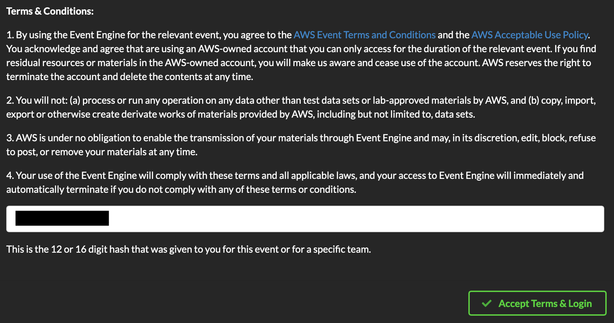

3. Выберите опцию **Email One-Time Password (OTP)**:

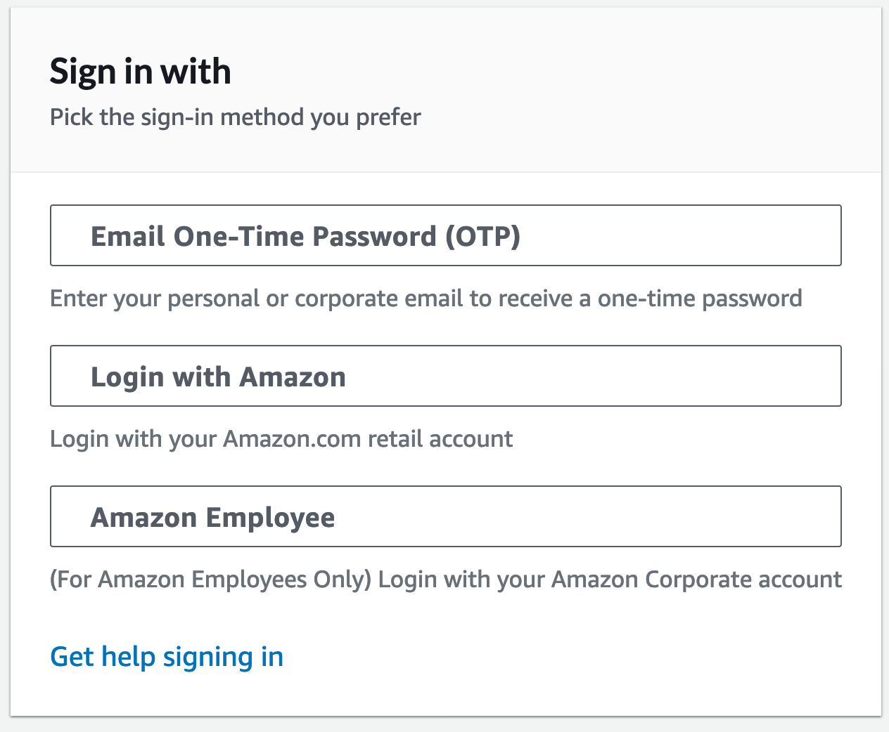

4. Введите свой e-mail адрес и нажмите **Send passcode**:

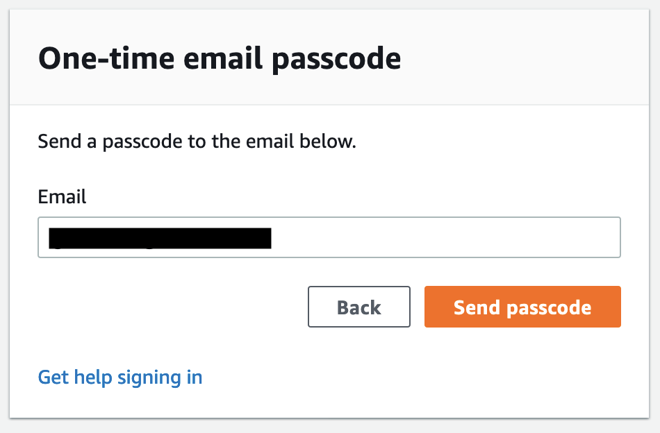

5. В течение нескольких минут вы должны получить письмо с кодом для входа из 6 цифр. Введите его в поле и нажмите **Sign in**:

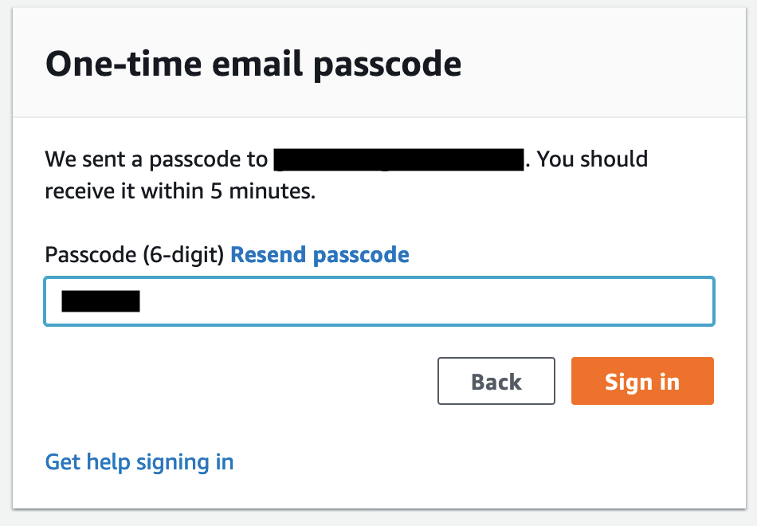

6. После этого должна открыться основная страница Event Engine с данными входа для воркшопа:

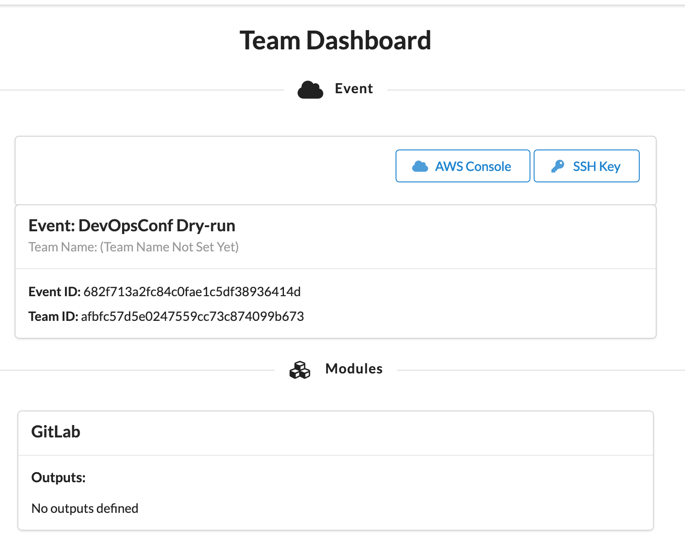

7. Сохраните ключ SSH. Для этого нажмите **SSH Key**, а затем **Download Key**. Копировать его куда-либо не нужно, на следующих шагах мы загрузим его в облачную среду Cloud9, чтобы получить доступ к инстансам GitLab по SSH: он потребуется только если вы захотите опционально настроить раннеры с помощью Docker Machine.

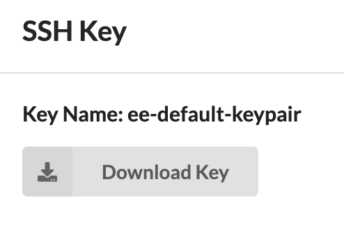

8. Закройте всплывающую форму SSH Key и зайдите в консоль AWS. Для этого нажмите **AWS Console**, а затем **Open AWS Console**:

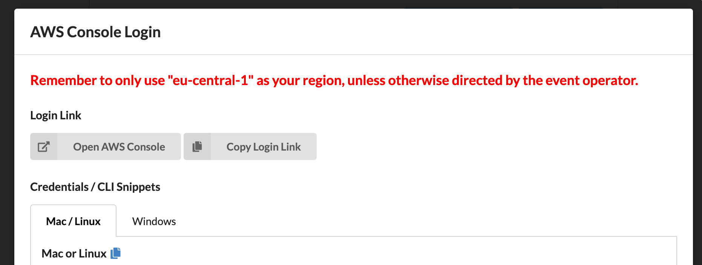

9. Убедитесь, что выбран регион **Frankfurt** (eu-central-1) или переключитесь на него, если выбран другой регион. Это можно увидеть в правом верхнем углу консоли:

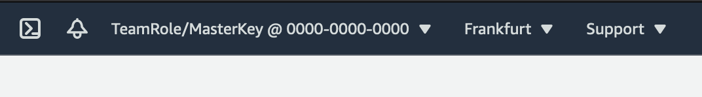

Далее мы сохраним информацию о предустановленном GitLab (в случае Event Engine для установки использовался AWS CloudFormation – это сервис для "инфраструктуры как кода").

1. В строке поиска консоли найдите сервис **CloudFormation** и перейдите в него:

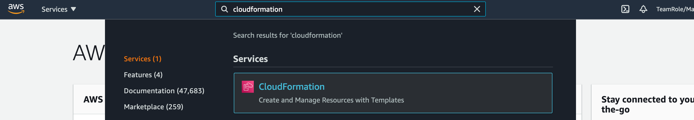

2. Раскройте меню слева и перейдите на страницу **Stacks**:

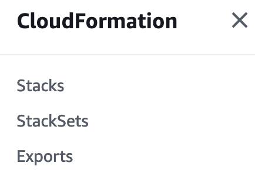

3. В списке должен быть один стек (с названием в формате `mod-...`). Откройте его и перейдите на вкладку **Outputs**.
4. Здесь вы увидите список с информацией об установленном инстансе GitLab. Либо скопируйте информацию в текстовый файл (она понадобится нам позже), либо оставьте вкладку открытой и для дальнейших шагов используйте отдельную вкладку:

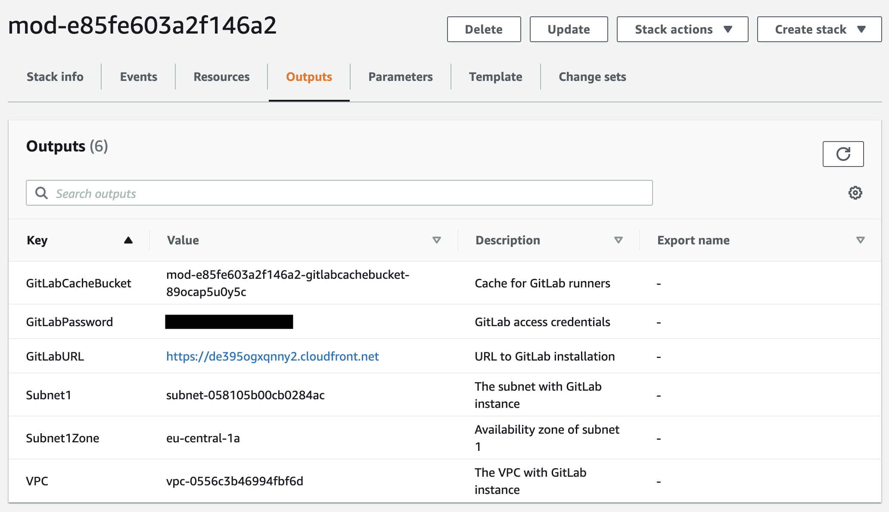

---

[Следующая секция](Section2.md)

[Вернуться к введению](../README.md)