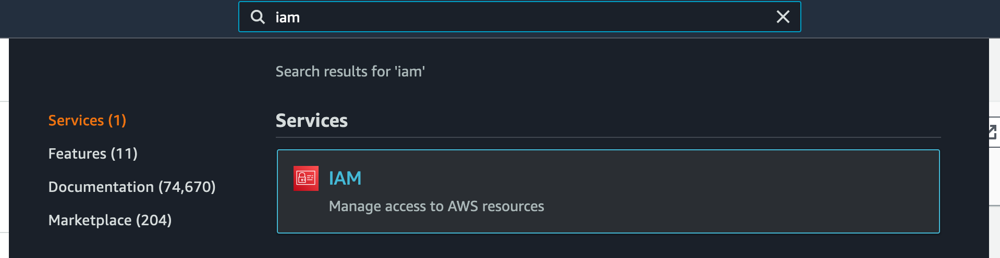
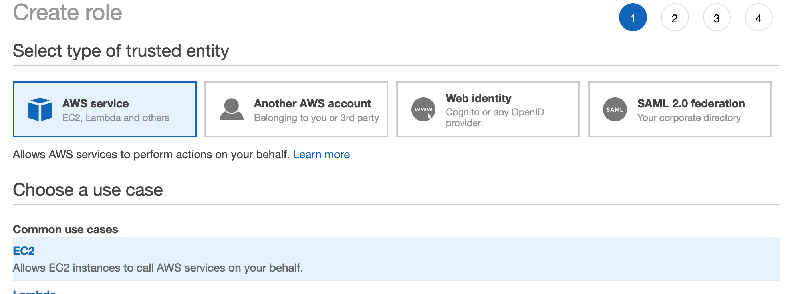
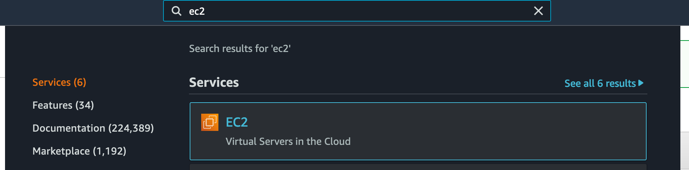
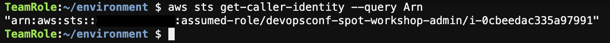

## 2. Настройка AWS Cloud9

Вы можете выполнять шаги данного воркшопа напрямую со своего ноутбука, но для этого нужно убедиться, что у вас установлены инструменты командной строки Git, Terraform, kubectl и AWS CLI. Вместо этого, чтобы не изменять локальные настройки, рекомендуется использовать AWS Cloud9: это облачный IDE, в котором вы можете получить доступ к терминалу и установить необходимые инструменты, при этом в отличии от инстанса EC2 вам нет необходимости управлять и настраивать его вручную.

1. В строке поиска консоли найдите сервис **Cloud9** и перейдите в него:


2. Нажмите **Create environment**.
3. Введите название вашей среды в поле **Name**, например, `devopsconf-spot-workshop` и нажмите **Next step**:


4. Выберите **Instance type** `t3.small`.


5. Раскройте секцию **Network settings (advanced)** и в поле **Network (VPC)** выберите VPC, идентификатор которого вы сохранили в первой секции воркшопа (название должно быть `DevOpsConf VPC`). Подсеть можно использовать любую из двух доступных:


6. Нажмите **Next step**.
7. На последнем шаге проверьте настройки и нажмите **Create environment**.
8. В течении нескольких минут среда Cloud9 будет готова. Если вы получите сообщение об ошибке *Unable to register Service Workers due to browser restrictions, Webviews will not work properly*, которое выдаётся в некоторых браузерах из-за недавних изменений с cookies, вы можете его игнорировать и просто закрыть, нажав кнопку **OK**. После этого вы можете закрыть внутри среды Cloud9 все вкладки, кроме окна терминала (по умолчанию он слева внизу). Его можно перетащить в верхнюю панель, чтобы развернуть на весь экран (если вы случайно закрыли терминал, то чтобы снова открыть его, нажмите **+** > **New Terminal**):


9. В окне терминала Cloud9 выполните следующую команду, чтобы скачать файлы воркшопа из репозитория:

```
git clone https://github.com/mikegolubev/devopsconf2021.git
```

По умолчанию Cloud9 использует временные данные доступа (AWS Managed Temporary Credentials) для вызовов к AWS API из командной строки. Вместо этого мы назначим на созданную среду администраторские права доступа через роль IAM и профиль инстанса EC2 (это понадобится нам для корректной конфигурации RBAC кластера Kubernetes чуть позже).

1. Вернитесь на вкладку браузера с консолью AWS. Если у вас не осталось открытых вкладок с ней, нажмите на иконку с облаком и цифрой 9 в левом верхнем углу (слева от пункта меню **File**), затем **Go To Your Dashboard**.
2. В строке поиска консоли найдите сервис **IAM** и перейдите в него:



3. Перейдите на страницу **Roles** слева и нажмите **Create role**.
4. В разделе **Choose a use case** выберите **EC2** и нажмите **Next: Permissions**:



5. В форме поиска найдите политику под названием `AdministratorAccess` и выберите её. Затем нажмите **Next: Tags**:


6. Нажмите **Next: Review**.
7. На финальном экране введите в поле **Role name** название роли `devopsconf-spot-workshop-admin` и нажмите **Create role**:


8. В строке поиска консоли найдите сервис **EC2** и перейдите в него:



9. В левом меню перейдите на страницу **Instances** в разделе **Instances**.
10. В списке будут два инстанса. Выберите инстанс, название которого начинается с **aws-cloud9-**, затем нажмите в меню **Actions** > **Security** > **Modify IAM role**:


11. В выпадающем списке **IAM Role** выберите только что созданную роль (`devopsconf-spot-workshop-admin`) и нажмите **Save**:


12. Вернитесь на вкладку браузера с открытым Cloud9 (если вы её закрыли, вы можете снова перейти на страницу сервиса, а затем нажать **Open IDE** на плашке созданной среды). Затем откройте настройки (иконка шестерёнки справа-сверху) и перейдите в раздел **AWS Settings**.
13. Отключите настройку **AWS managed temporary credentials**:


14. Вернитесь на вкладку терминала в Cloud9 и убедитесь, что используется корректная роль (в выводе следующей команды вы должны увидеть `devopsconf-spot-workshop-admin`):

```bash
aws sts get-caller-identity --query Arn
```



В последней части данной секции мы загрузим ключ доступа SSH в Cloud9 и произведём дополнительные настройки.

1. В Cloud9 нажмите **File** > **Upload Local Files...**:


2. В открывшейся форме нажмите **Select files** и выберите файл `ee-default-keypair.pem`, который вы скачале в первой секции воркшопа.

3. Убедитесь, что файл появился в списке файлов слева, затем в терминале выполните следующую команду, чтобы назначить ему корректные права доступа:

```
chmod 600 ~/environment/ee-default-keypair.pem 
```

4. Включите настройку Cloud9, показывающую скрытые файлы (она нам понадобится для редактирования файлов настроек CI/CD в GitLab). Для этого нажмите на иконку шестерёнки сверху над списком файлов и включите опцию **Show Hidden Files**


---

[Следующая секция](Section3.md)

[Вернуться к введению](../README.md)