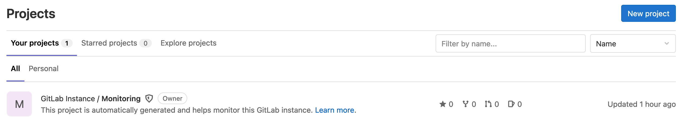
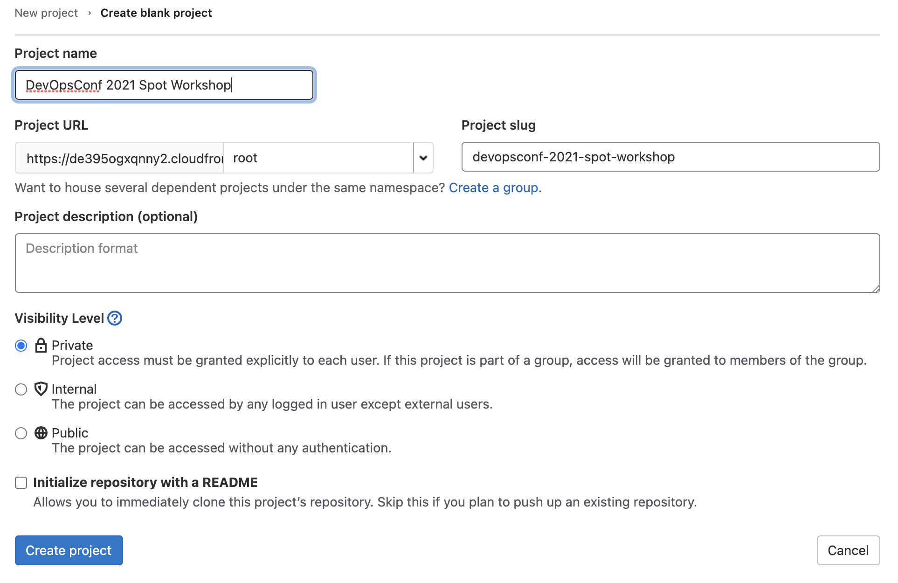
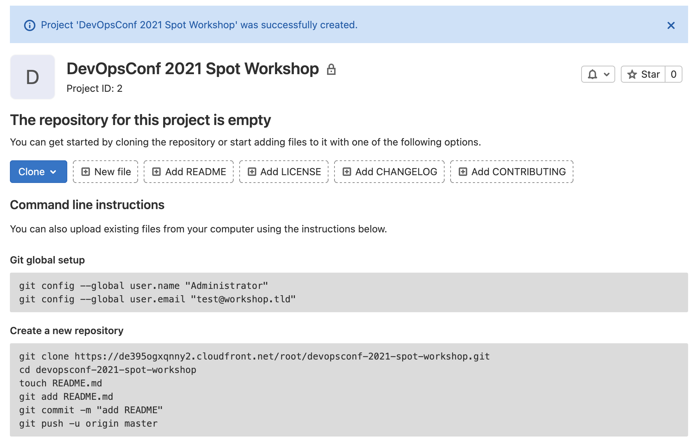

## 3. Настройка репозитория GitLab

В этой секции мы создадим репозиторий в GitLab и настроим его в среде Cloud9. Затем мы закоммитим код тестового приложения, но до настройки CI/CD (следующая секция) не будем делать push.

1. Откройте новую вкладку и зайдите в GitLab: URL и пароль показаны в параметрах GitLabURL и GitLabPassword стека CloudFormation из [первой секции](Section1.md). В качестве имени пользователя используйте `root`.
2. Нажмите **New project**:



3. Выберите опцию **Create blank project**.
4. В **Project name** введите `DevOpsConf 2021 Spot Workshop`, остальные значения оставьте по умолчанию:



5. Сохраните адрес репозитория, который отображается в том числе в секции **Create a new repository** на открывшемся экране (`https://xxx.cloudfront.net/root/devopsconf-2021-spot-workshop.git`):



6. Вернитесь на вкладку Cloud9 и в терминале выполните следующие команды, чтобы удалить директории `.git` от репозитория GitHub:

```bash
cd ~/environment/devopsconf2021/
rm -rf demo-app/.git/
rm -rf demo-app-lambda/.git/
```

7. Затем выполните следующие команды, чтобы перейти в директорию `demo-app` с тестовым приложением и заменить значение `ECR_ADDRESS` (адрес репозитория для образов контейнеров), на ARN (Amazon Resource Name, то есть, уникальный идентификатор ресурса) репозитория, уже созданного вместе с аккаунтом (в стеке CloudFormation):

```bash
cd demo-app
export ECR_ADDRESS=$(aws ecr describe-repositories --repository-names devopsconf-demo --region eu-central-1 --query repositories[0].repositoryUri --output text | awk -F'/' '{print $1}')
sed "s/\${ECR_ADDRESS}/${ECR_ADDRESS}/g" template-gitlab-ci.yml > .gitlab-ci.yml
```

8. Задайте имя и e-mail, которые будут использоваться в Git:

```bash
git config --global user.name "YourName"
git config --global user.email "youremail@test.tld"
```

9. Опционально вы можете включить сохранение логина и пароля от GitLab в конфигурации Git следующей командой (иначе их нужно будет вводить при каждом взаимодействии с репозиторием):

```bash
git config --global credential.helper store
```

10. Инициируйте git в директории (в URL используйте адрес репозитория, который вы сохранили на шаге выше) и создайте новый коммит:

```bash
git init
git remote add origin https://xxx.cloudfront.net/root/devopsconf-2021-spot-workshop.git
git add .
git commit -m "Initial commit"
```

---

[Следующая секция](Section4.md)

[Вернуться к введению](../README.md)