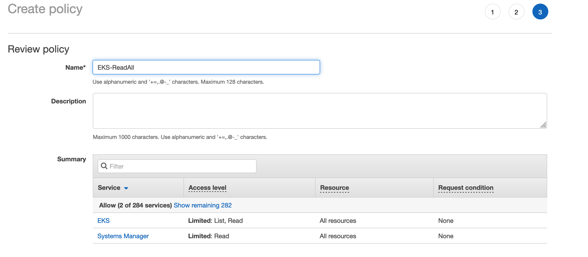

## 4. Настройка GitLab CI/CD на спотах

В этой секции для конфигурации раннеров мы воспользуемся новым решением от GitLab под названием **GitLab HA Scaling Runner Vending Machine for AWS** (полный список функциональных отличий доступен по ссылке https://gitlab.com/guided-explorations/aws/gitlab-runner-autoscaling-aws-asg/-/blob/main/FEATURES.md). Он реализован на CloudFormation, но вы можете реализовать аналогичную логику и с использованием других инструментов, например, Terraform. Если вы хотите вручную настроить раннеры с помощью Docker Machine (не использует Auto-Scaling Groups, поэтому обладает некоторыми недостатками по сравнению с текущим подходом), соответствующие шаги воркшопа доступны по [ссылке](Runners-Docker-Machine.md).

1. Вернитесь на вкладку браузера с GitLab.
2. В репозитории **DevOpsConf 2021 Spot Workshop** перейдите в меню слева на страницу **Settings** > **CI/CD**.
3. Нажмите **Expand** в разделе **Runners**:


4. Сохраните в текстовый файл значения адреса GitLab и токена для регистрации, показанные на экране.
5. В консоли AWS откройте ссылку https://eu-central-1.console.aws.amazon.com/cloudformation/home?region=eu-central-1#/stacks/create/review?templateURL=https://gl-public-templates.s3.amazonaws.com/cfn/v1.4.7-alpha12/easybutton-amazon-linux-2-docker-manual-scaling-with-schedule-spotonly.cf.yml&stackName=linux-docker-spotonly, которая указывает на консоль CloudFormation с предзаполненным значением **Template URL**. Если ссылка выше недоступна или шаблон стека не найден, откройте страницу https://gitlab.com/guided-explorations/aws/gitlab-runner-autoscaling-aws-asg#gitlab-runners-on-aws-spot-best-practices и выберите опцию **Amazon Linux 2 Docker HA with Manual Scaling and Optional Scheduling. 100% spot.**, обязательно переключите регион на **eu-central-1**, если вы используете ссылку с указанной страницы вместо приведённой выше).
6. В **GitLab Instance URL** введите адрес инстанса GitLab (формата `https://xxx.cloudfront.net/`)
7. В поле **One or more runner Registration tokens from the target instance** введите токен, который был получен из GitLab.
8. В поле **The number of instances that should be configured. Generally 1 for warm HA and 2 for hot HA.** введите `2`, чтобы у нас было создано два раннера (автоматическое масштабирование можно подключить отдельно).
8. В поле **The VPC in the account and region should be used** введите идентификатор VPC из Outputs стека CloudFormation в первой секции (формата `vpc-...`)
9. Оставьте остальные настройки по умолчанию. Внизу экрана выберите галочки **I acknowledge that AWS CloudFormation might create IAM resources with custom names.** и **I acknowledge that AWS CloudFormation might require the following capability: CAPABILITY_AUTO_EXPAND**, а затем нажмите **Create stack**:


10. Дождитесь, пока стек перейдёт в статус `CREATE_COMPLETE` (при необходимости обновляйте страницу), это должно занять около 5-7 минут.

Теперь мы обновим стек (точнее, дочерний стек с самими ресурсами, созданный автоматически), назначив на него новую роль, которая позволит раннерам, помимо всего прочего, работать с сервисами [Amazon ECR](https://aws.amazon.com/ru/ecr/) и [Amazon EKS](https://aws.amazon.com/ru/eks/). Для этой роли мы сначала создадим необходимые политики доступа. Важно: при использовании полного шаблона решения от GitLab без Quick Buttons (более подробное описание по [ссылке](https://gitlab.com/guided-explorations/aws/gitlab-runner-autoscaling-aws-asg)), это можно сделать в один шаг без дополнительного обновления стека: такой способ рекомендуется использовать в промышленной среде.

1. Вернитесь на вкладку браузера с IAM (или откройте сервис через форму поиска, если уже закрыли вкладку).
2. Перейдите на страницу **Policies** слева и нажмите **Create policy**.
3. Выберите вкладку **JSON** и введите следующую политику:

```json
{
    "Version": "2012-10-17",
    "Statement": [
        {
            "Effect": "Allow",
            "Action": [
                "eks:DescribeNodegroup",
                "eks:ListNodegroups",
                "eks:DescribeCluster",
                "eks:ListClusters",
                "eks:AccessKubernetesApi",
                "ssm:GetParameter",
                "eks:ListUpdates",
                "eks:ListFargateProfiles"
            ],
            "Resource": "*"
        }
    ]
}
```


4. Нажмите **Next: Tags**.
5. Нажмите **Next: Review**.
6. Введите название политики `EKS-ReadAll` и нажмите **Create policy**:



7. Перейдите на страницу **Roles** слева и нажмите **Create role**.
8. В разделе **Choose a use case** выберите **EC2** и нажмите **Next: Permissions**:


9. В форме поиска поочередно найдите политики под названиями `EKS-ReadAll`, `AmazonS3FullAccess`, `AmazonEC2RoleforSSM`, `CloudWatchAgentServerPolicy`, `AmazonSSMAutomationRole`, `AmazonSSMMaintenanceWindowRole` и `AmazonEC2ContainerRegistryFullAccess`, а также две политики, созданные CloudFormation-стеком с фразами `EC2SelfAccessPolicy` и `ASGSelfAccessPolicy` в названии и выберите все из них (важно: в рамках воркшопа мы выдаём достаточно широкие привилегии, чтобы избежать тонкой настройки политик, в промышленной среде рекомендуется более строго ограничивать привилегии). Затем нажмите **Next: Tags**.
10. Нажмите **Next: Review**.
11. На финальном экране введите в поле **Role name** название роли `GitLabRunner` и нажмите **Create role**:


12. Вернитесь на вкладку CloudFormation и выберите новый стек, который был создан автоматически и помечен как **NESTED** (если он не виден, обновите страницу):


13. Нажмите **Update**, а затем выберите опцию **Update nested stack** и нажмите **Update stack**:


14. Нажмите **Next** (при этом должна быть выбрана опция по умолчанию **Use current template**).
15. Найдите параметр **Override automatic IAM Instance Profile for a precreated one** и замените его значение на `GitLabRunner`.
16. Найдите параметр **4ASGUpdateMinInstancesInService** и замените его значение на `0`: это позволит быстрее обновить группу новыми инстансами, но не используйте такое значение в промышленной среде, так как тогда на время обновления у вас может не остаться активных раннеров.
17. Нажмите **Next**, а затем ещё раз **Next**.
18. На финальном шаге выберите галочку **I acknowledge that AWS CloudFormation might create IAM resources with custom names.** и нажмите **Update stack**.
19. Дождитесь, пока стек перейдёт в статус **UPDATE_COMPLETE**, это должно занять около 3-5 минут.
20. (опционально) Вернитесь на вкладку браузера с консолью EC2 и обновите список инстансов. Убедитесь, что появилось два новых инстанса для раннера GitLab. При нажатии на каждый из них в поле **Lifecycle** будет значение `spot`:


21. Вернитесь на вкладку браузера с GitLab и обновите страницу настроек CI/CD. Убедитесь, что оба новых раннера появились в секции **Runners**:


22. Вернитесь на вкладку браузера с Cloud9 и в терминале выполните следующую команду, чтобы сделать push в репозиторий. При запросе логина и пароля введите те же самые значения, которые вы использовали для входа в начале этой секции: пользователь `root` и пароль из стека CloudFormation в [первой секции](Section1.md):

```
git push -u origin master
```

23. Вернитесь на вкладку браузера с GitLab и перейдите на страницу **CI/CD** > **Pipelines**.
24. Убедитесь, что CI/CD-конвейер успешно завершён, либо дождитесь его завершения. Если возникли проблемы, вы можете открыть информацию о соответствующем этапе и посмотреть подробный лог выполнения:


25. Вернитесь на вкладку браузера с консолью AWS.
26. В строке поиска консоли найдите сервис **Elastic Container Registry** и перейдите в него:


27. Раскройте меню слева и перейдите на страницу **Repositories**:


28. Нажмите на репозиторий **devopsconf-demo**.
29. Убедитесь, что в списке виден собранный образ:


Всё! Вы успешно собрали первое приложение в GitLab CI/CD на раннерах, полностью запущенных на спотовых инстансах.

---

[Следующая секция](Section5.md)

[Вернуться к введению](../README.md)