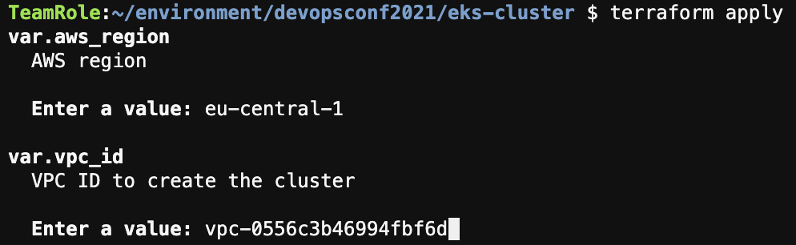
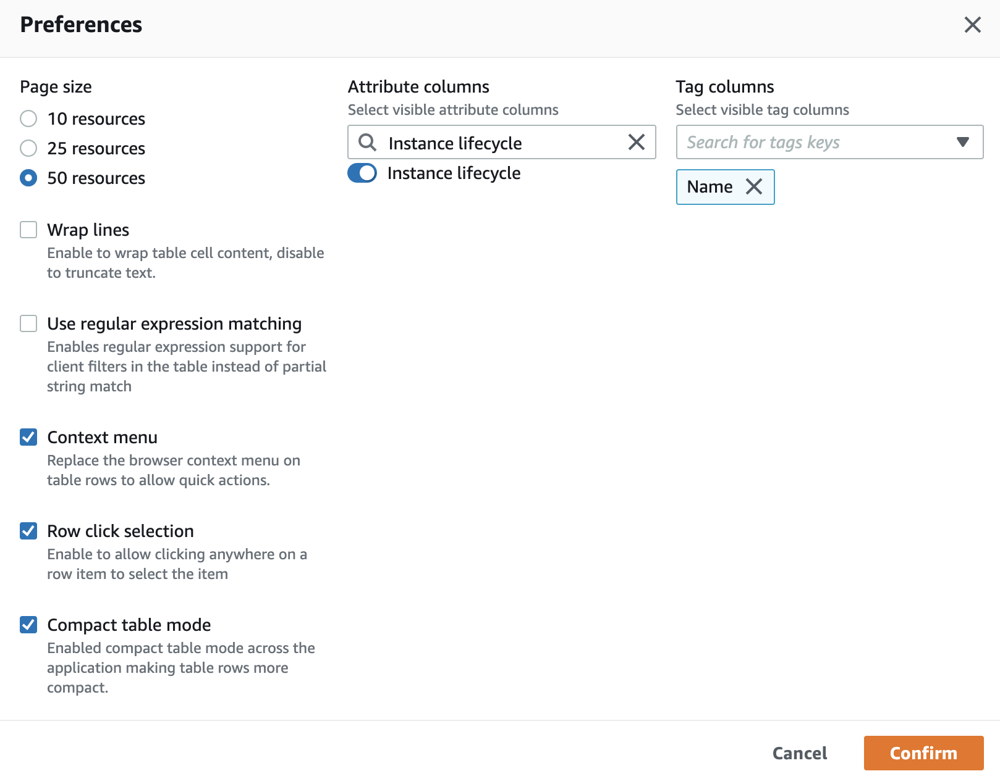
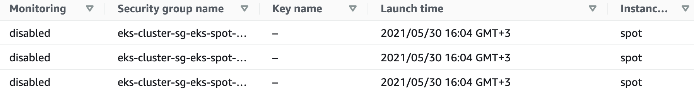
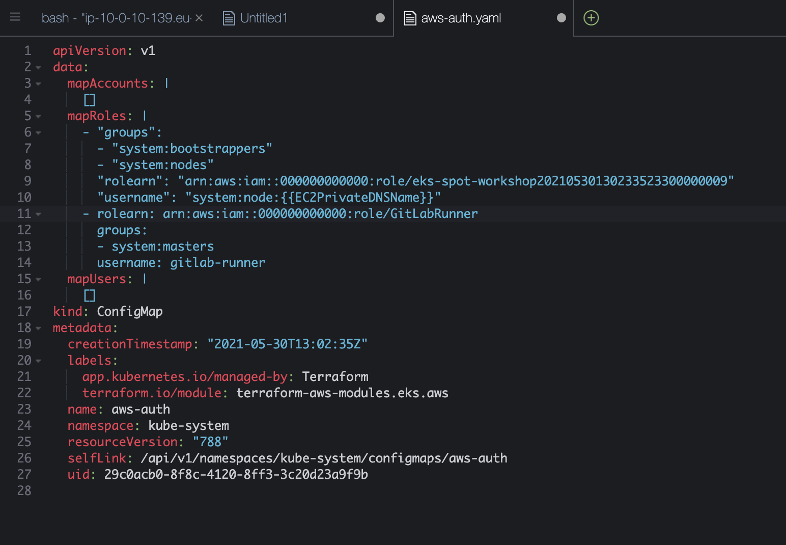
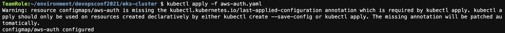

## 5. Развёртывание Amazon EKS на спотах через Terraform

Для следующей секции воркшопа нам понадобится установленный Kubernetes. Мы развернём его с помощью управляемого сервиса Amazon EKS полностью на спотах через Terraform из терминала Cloud9. В зависимости от вашего сценария, вы можете также это делать прямо в GitLab CI/CD.

1. Вернитесь на вкладку браузера с Cloud9 и выполните следующие команды в терминале, чтобы установить `kubectl`:

```bash
sudo curl -sLo /usr/local/bin/kubectl "https://dl.k8s.io/release/$(curl -L -s https://dl.k8s.io/release/stable.txt)/bin/linux/amd64/kubectl"
sudo chmod +x /usr/local/bin/kubectl
```

2. Инициализируйте шаблон Terraform для кластера Amazon EKS на спотах и разверните его:

```bash
cd ~/environment/devopsconf2021/eks-cluster/
terraform init
terraform apply
```

3. При запросе параметров, введите регион `eu-central-1` и название VPC из Outputs стека CloudFormation в первой секции (формата `vpc-...`) соответственно:



4. После отображения проверьте список планируемых действий и введите `yes`, затем нажмите Enter.

Создание кластера займёт около 10-15 минут: если всё идёт по плану, то сейчас как раз будет перерыв в воркшопе, после которого мы продолжим.

1. После завершения выполнения `terraform apply` в терминале Cloud9 выполните следующую команду, чтобы обновить `kubeconfig`, используя данные Amazon EKS:

```bash
aws eks update-kubeconfig --region eu-central-1 --name eks-spot-workshop
```

2. Теперь вы можете проверить работу кластера, например, используя следующие команды:

```bash
kubectl get all -A
kubectl get nodes
```

3. Вернитесь на вкладку браузера с консолью EC2, страницей **Instances** и убедитесь, что ноды используют спотовые инстансы: например, вы можете посмотреть значение **Lifecycle** для каждого инстанса, как мы делали в [предыдущей секции](Section4.md), либо включить отображение соответствующего поля в списке всех инстансов, нажав на знак шестерёнки, а затем введя в поле **Attribute columns** слова `Instance lifecycle`:





4. Чтобы разрешить GitLab доступ к API кластера Kubernetes, необходимо добавить его роль в RBAC, используя ConfigMap `aws-auth`. Это можно было сделать через Terraform, но мы специально делаем вручную, чтобы подробно понять, как это работает. Чтобы получить строки, которые вам нужно будет добавить, вернитесь на вкладку браузера с Cloud9 и выполните следующие команды в терминале:

```bash
kubectl get configmap -n kube-system aws-auth -o yaml > aws-auth.yaml
export ACCOUNT_ID=$(aws sts get-caller-identity --output text --query Account)
cat << EoF
    - rolearn: arn:aws:iam::${ACCOUNT_ID}:role/GitLabRunner
      groups:
      - system:masters
      username: gitlab-runner
EoF
```

5. Теперь откройте файл `~/environment/devopsconf2021/eks-cluster/aws-auth.yaml` (например, кликнув по нему два раза в меню слева) и добавьте текст из вывода предыдущей команды в секцию `mapRoles` (не забудьте сохранить файл, используя **Ctrl + S** или **Cmd + S** в зависимости от операционной системы, либо нажав **File** > **Save**). В итоге должно получиться примерно следующее:



6. Закройте файл и примените его, выполнив следующую команду в терминале Cloud9 (возникающий в процессе warning можно игнорировать):

```bash
kubectl apply -f aws-auth.yaml
```



---

[Следующая секция](Section6.md)

[Вернуться к введению](../README.md)