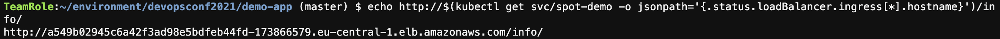

## 6. Установка приложения в Amazon EKS с GitLab CI/CD

В этой секции мы развернём в только что созданном кластере Kubernetes на спотах приложение, которое мы раньше только собирали.

1. В Cloud9 в списке файлов слева откройте `~/environment/devopsconf2021/demo-app/.gitlab-ci.yml` (если файл не виден, вернитесь в секцию настройки Cloud9 и включите отображение скрытых файлов).
2. Поменяйте этапы `deploy_to_eks` и `test_on_eks` на следующие:

```yaml
deploy_to_eks:
  stage: deploy
  image: registry.gitlab.com/gitlab-org/cloud-deploy/aws-base:latest
  before_script:
    - aws --version
    - aws eks update-kubeconfig --region $REGION --name $K8S_CLUSTER_NAME
    - apt-get install -y gettext # To get envsubst
    - curl -sLo /usr/local/bin/kubectl "https://dl.k8s.io/release/$(curl -L -s https://dl.k8s.io/release/stable.txt)/bin/linux/amd64/kubectl"
    - chmod +x /usr/local/bin/kubectl
  script:
    - envsubst < k8s_deploy.yaml > k8s_deploy_filled.yaml
    - kubectl apply -f k8s_deploy_filled.yaml
    - kubectl rollout status deploy/spot-demo
    - kubectl get services/spot-demo -o wide
    - echo "SERVICE_ADDRESS=$(kubectl get service spot-demo -o jsonpath='{.status.loadBalancer.ingress[*].hostname}')" >> deploy_to_eks.env
  artifacts:
    reports:
      dotenv: deploy_to_eks.env

test_on_eks:
  stage: test
  image: registry.gitlab.com/gitlab-org/cloud-deploy/aws-base:latest
  before_script:
    - echo Verifying service on $SERVICE_ADDRESS
  script:
    - |
      echo Waiting for the service to respond with 200
      serviceup=0

      for i in {1..60}
      do
        export result=$(curl -s -o /dev/null -w "%{http_code}" http://$SERVICE_ADDRESS/info/)

        if [[ "$result" -eq 200 ]]
        then
          serviceup=1
          break
        fi

        echo Load balancer not ready yet
        sleep 10
      done

      if [[ "$serviceup" -eq 1 ]]
      then
        echo Service responded with 200
      else
        echo Service not responded within the timeout
        exit 1
      fi

      for i in {1..50}
      do
        echo -n "Test $i: "
        export result=$(curl -s http://$SERVICE_ADDRESS/info/ | egrep 'lifecycle.*spot' | wc -l)
        if [[ "$result" -eq 1 ]]
        then
          echo -e "\033[0;32mOK\033[0m"
        else
          echo -e "\033[0;31mNOT OK\033[0m"
          exit 1
        fi
      done
  dependencies:
    - deploy_to_eks
```


3. Создайте коммит с новым шаблоном CI/CD и сделайте push:

```bash
cd ~/environment/devopsconf2021/demo-app/
git add .gitlab-ci.yml
git commit -m "Added deployment to EKS"
git push
```

4. Вернитесь на вкладку браузера с GitLab и перейдите на страницу **CI/CD** > **Pipelines** в проекте **DevOpsConf 2021 Spot Workshop**, если вы уже ушли с неё.
5. Дождитесь, пока CI/CD-конвейер в GitLab успешно завершится.
6. Вы можете открыть соответствующий этап конвейера, чтобы увидеть лог выполнения, например, для этапа тестирования он выглядит вот так:


7. Вернитесь на вкладку браузера с Cloud9 и выведите информацию о созданном сервисе, выполнив следующую команду в терминале:

```bash
echo http://$(kubectl get svc/spot-demo -o jsonpath='{.status.loadBalancer.ingress[*].hostname}')/info/
```



8. Откройте указанный URL в новой вкладке браузера и обновите страницу несколько раз, чтобы убедиться, что запросы идут к подам на разных нодах, созданных на спотах:


Таким образом, мы развернули наше тестовое приложение на кластере Kubernetes (в сервисе Amazon EKS), все рабочие узлы которого запущены на спотовых инстансах. Это может быть удобно для проведения тестирования (хотя некоторые заказчики используют полностью спотовые кластеры и для запуска приложений в промышленной эксплуатации): например, вы можете прямо из GitLab добавлять спотовые инстансы в кластер, а после тестирования удалять их или вообще создавать/удалять весь кластер.

---

[Следующая секция](Section7.md)

[Вернуться к введению](../README.md)