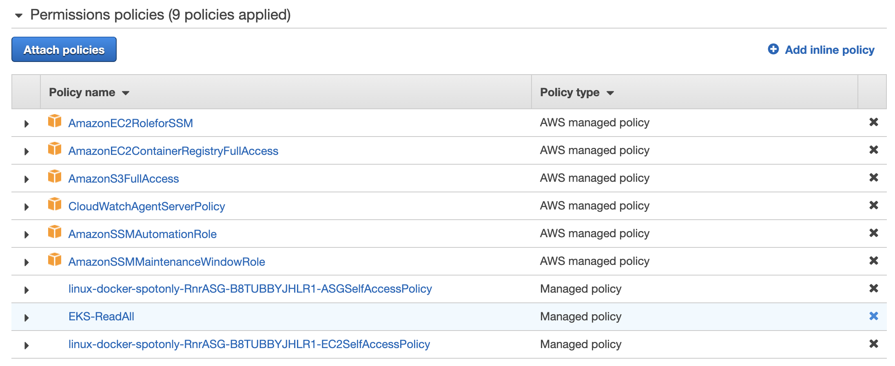

## 7. Установка приложения в AWS Lambda с GitLab CI/CD (опциональные шаги)

Начиная с декабря 2020 года [в Lambda можно запускать Docker-контейнеры](https://aws.amazon.com/blogs/aws/new-for-aws-lambda-container-image-support/). Для этого нужно произвести минимальные изменения в приложении. В следующем примере мы посмотрим, как это сделать. Чтобы увидеть внесённые изменения можно сравнить файлы `app.py` и `Dockerfile` между двумя приложениями.

Мы заменим файлы в текущем репозитории, чтобы не тратить время на создание нового проекта и его настройку.

Кроме того, хотя [AWS Serverless Application Model (SAM)](https://aws.amazon.com/serverless/sam/), который мы будем использовать для развёртывания и может создать необходимые IAM-роли, хорошей практикой в безопасности является создание их заранее и запрет раннерам CI/CD на создание любых сущностей IAM. Поэтому вначале создадим роль для выполнения Lambda.

1. Вернитесь на вкладку браузера с консолью IAM.
2. Перейдите на страницу **Roles** слева и нажмите **Create role**.
3. В разделе **Choose a use case** выберите **Lambda** и нажмите **Next: Permissions**.
4. В форме поиска найдите политику под названием `AWSLambdaBasicExecutionRole` и выберите её. Затем нажмите **Next: Tags**.
5. Нажмите **Next: Review**.
6. На финальном экране введите в поле **Role name** название роли `LambdaExecutionRole` и нажмите **Create role**:


7. Теперь необходимо дать раннерам GitLab права на создание необходимых ресурсов AWS для развёртывания Lambda-функции. На экране **Roles** найдите роль `GitLabRunner`, которую мы создавали ранее, и откройте её.
8. Под списком политик нажмите **Show 7 more**, найдите в списке политику `EKS-ReadAll` и нажмите крестик справа от неё:



9. Подтвердите операцию, нажав **Detach**:


10. Нажмите **Attach policies**.
11. В списке по очереди найдите политики `AWSLambda_FullAccess` и `AWSCloudFormationFullAccess`, выберите обе.
12. Нажмите **Attach policy**.
13. Вернитесь на вкладку браузера с Cloud9.
14. В терминале выполните следующие команды, чтобы скопировать файлы из директории `demo-app-lambda`:

```bash
cd ~/environment/devopsconf2021/
cp -ar demo-app{,.bak}
cp -ar ./demo-app-lambda/* ./demo-app
cd demo-app
```

15. Выполните следующие команды, чтобы заменить необходимые параметры в конфигурации GitLab CI/CD:

```bash
export ACCOUNT_ID=$(aws sts get-caller-identity --output text --query Account)
export ECR_ADDRESS=$(aws ecr describe-repositories --repository-names devopsconf-demo-lambda --region eu-central-1 --query repositories[0].repositoryUri --output text | awk -F'/' '{print $1}')
sed "s/\${ECR_ADDRESS}/${ECR_ADDRESS}/g" template-gitlab-ci.yml | sed "s/\${ACCOUNT_ID}/${ACCOUNT_ID}/g" > .gitlab-ci.yml
```

16. Выполните следующие команды, чтобы добавить все файлы в репозиторий:

```bash
git add .
git commit -m "Changed to run on Lambda"
git push
```

17. Вернитесь на вкладку с GitLab и на странице **CI/CD** > **Pipelines** дождитесь, пока CI/CD-конвейер в GitLab успешно завершится.
18. Вернитесь на вкладку браузера с консолью AWS.
19. В строке поиска консоли найдите сервис **Lambda** и перейдите в него:


20. Нажмите на функцию с названием формата `demo-app-lambda-...` (как можно увидеть, её **Package type** равен `Image`):


21. Перейдите на вкладку **Test** и нажмите **Test**:


22. После завершения выполнения функции раскройте секцию **Execution result** и убедитесь, что возвращены корректные значения (информация об инстансе, на котором запущен контейнер, показывается как `undefined`, так как мы используем подход serverless):


Таким образом, мы увидели, что с помощью serverless-подхода тоже можно запускать контейнеры и настроили наш CI/CD на спотовых инстансах для этого.

---

[Следующая секция](Section8.md)

[Вернуться к введению](../README.md)