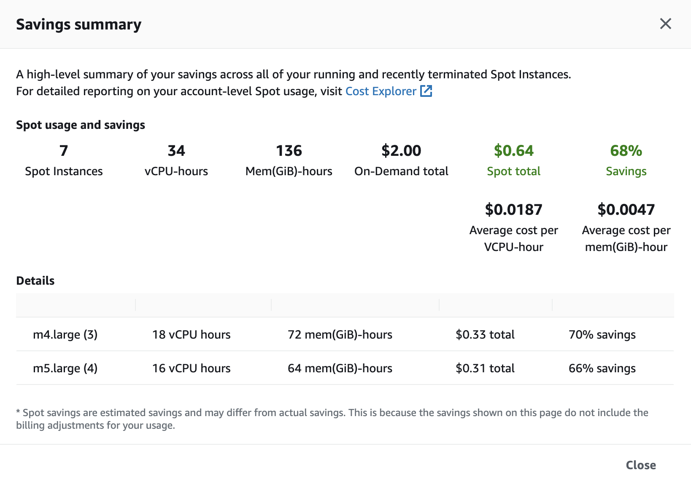

## 8. Заключение и удаление ресурсов

В этой секции мы посмотрим на текущую экономию от использования спотов вместо инстансов по требованию, а также удалим созданные ресурсы AWS (не обязательно при использовании аккаунтов Event Engine: в них ресурсы будут автоматически уничтожены после воркшопа).

1. Вернитесь на вкладку браузера с консолью EC2.
2. Перейдите на страницу **Spot Requests** в меню слева.
3. Нажмите **Savings summary**, чтобы увидеть текущую экономию:



Для удаления ресурсов выполните следующие шаги:

1. Вернитесь на вкладку браузера с Cloud9 и в терминале выполните следующие команды, чтобы удалить сервис из Kubernetes:

```bash
kubectl delete services/spot-demo
kubectl delete deployments/spot-demo
```

2. Выполните следующие команды, чтобы удалить кластер EKS (введите те же параметры, что и при установке: регион `eu-central-1` и VPC из стека CloudFormation в [первой секции](Section1.md), при запросе подтверждения введите `yes`):

```bash
cd ~/environment/devopsconf2021/eks-cluster/
terraform destroy
```

3. Если вы проходили опциональные шаги по использованию Docker Machine для раннеров, то в консоли EC2 удалите все раннеры (инстансы с названием формата `runner-...`), если они ещё не были удалены автоматически, а также инстанс `GitLabRunnerManager`. Также в консоли EC2 удалите созданные Security Groups (`GitLabRunner`, `GitLabRunnerManager`).
4. В консоли CloudFormation удалите стек `linux-docker-spotonly` (стек, помеченный как NESTED будет удалён автоматически).
5. В консоли CloudFormation удалите стек `demo-app-lambda` с Lambda-функцией, созданный через SAM (если вы выполняли опциональное задание).
6. В консоли Cloud9 удалите созданную среду.
7. В консоли IAM удалите все созданные роли (`devopsconf-spot-workshop-admin` и `GitLabRunner`; а также `LambdaExecutionRole`, если вы выполняли опциональное задание) и политики (`EKS-ReadAll`; а также `IAM-PassRole`, если вы проходили шаги для Docker Machine).
8. В консоли ECR откройте оба репозитория по очереди и удалите из них все образы (сами репозитории удалять не надо, они будут автоматически удалены на следующем шаге).
9. Удалите изначальный стек CloudFormation, создавший инфраструктуру для инстанса GitLab (только если вы создавали его самостоятельно: Event Engine не разрешит вам удалить стек).

---

[Вернуться к введению](../README.md)